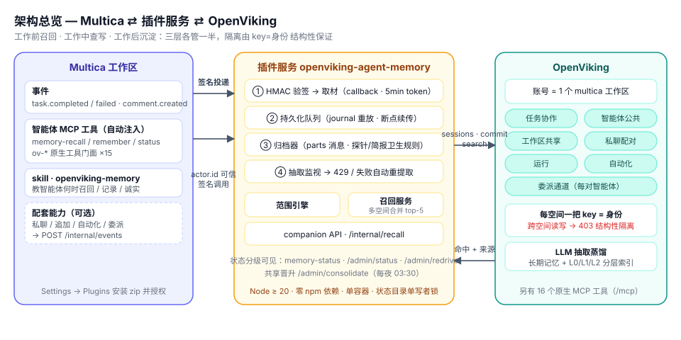
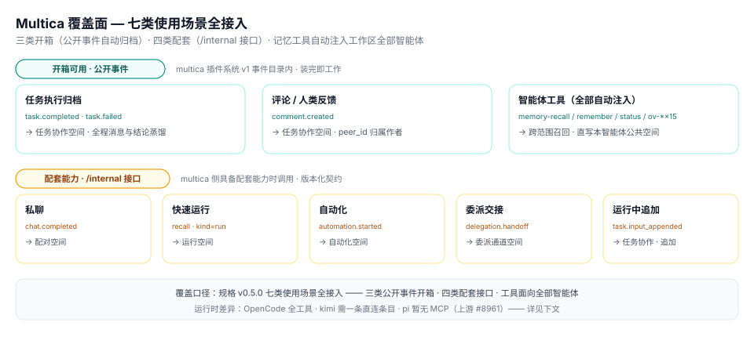
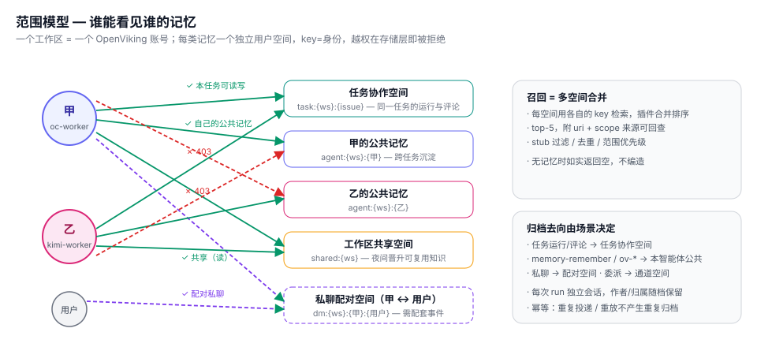
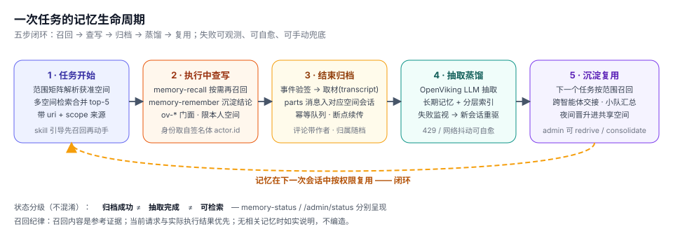

# OpenViking Agent Memory · Multica 插件

[](../../actions)
[](../../releases)
[](LICENSE)

> 给 Multica 工作区里的智能体一套**按范围隔离的长期记忆**：任务开始前召回相关记忆，执行中随时查写，运行结束后把业务记录交给 OpenViking 蒸馏成可检索的长期记忆。
>
> Agent memory for Multica, backed by OpenViking: scoped recall before work, read/write tools during work, distilled long-term memory after work — with structural isolation between scopes.

**零 npm 依赖**（Node ≥ 20，`node src/server.mjs` 即可跑）· **公开契约优先**（Multica 插件系统 v1 + OpenViking REST；运行转写需要 multica 的任务读取 API，见 [`upstream/multica/`](upstream/multica/README.md)）· **隔离不靠自觉**（每个范围一个 OV 用户空间，跨空间读写被存储层拒绝；账号共享的命名空间由门面拒绝；每个安装绑定唯一工作区）

---

## 我们在做什么

智能体每次接到任务都是从零开始，跨任务、跨智能体的经验无处沉淀。这个插件把 OpenViking（多租户记忆库）接入 Multica：每次运行的业务输入、回复、工具调用都会被归档并蒸馏为长期记忆；下一次任务开始时，智能体能按权限召回它们——并且**只**召回它有权限看到的那些。



三层分工：

- **Multica**：发出事件（任务完成/评论）、把插件的工具注入给智能体、承载 skill；
- **插件服务**：验签与安装绑定、取材、持久化归档队列、抽取监视与重驱、范围引擎、召回合并、`ov-*` 门面的空间限制；
- **OpenViking**：每类记忆一个独立用户空间，LLM 抽取蒸馏 + 分层索引，16 个原生 MCP 工具。

## Multica 覆盖面

功能规格 v0.5.0 的**七类记忆范围已实现**。评论在 multica 插件系统 v1 的公开事件内开箱即用；运行类场景（issue 任务、私聊、快速创建、自动化、委派）由 `task.completed` / `task.failed` 驱动，插件通过 multica 的**任务读取 API** 得知运行类型、触发输入和转写，再归档进对应空间——stock multica 没有这组 API，补丁见 [`upstream/multica/`](upstream/multica/README.md)；运行中追加要求等仍可经插件的版本化配套接口（`/internal/events` / `/internal/recall`）推送。`memory-*` 与 `ov-*` 工具随安装**自动注入工作区全部智能体**。

范围实现不代表每个入口、客户端和运行时都已通过真实智能体验收。实际测试范围与限制见 [`e2e/real-agent/`](e2e/real-agent/README.md)。运行中追加要求仍需对接配套接口，并依赖运行时支持；当前 OpenCode 适配器不支持向进行中的运行追加输入。



## 核心概念：范围与隔离

一个 multica 工作区 = 一个 OpenViking 账号；七类使用场景（任务协作 / 智能体公共 / 工作区共享 / 私聊配对 / 运行 / 自动化 / 委派通道）各对应一个独立用户空间。**每把 key 只能读写自己的用户空间**——智能体甲永远读不到乙的公共记忆，不是靠提示词约束，而是存储层直接 403。账号内另有 `viking://resources` / `viking://agent` 两个所有用户共享的命名空间，存储层不隔离它们，所以插件的 `ov-*` 门面不允许访问（见下文）。



| 使用场景 | 读取范围 | 归档去向 | 驱动方式 |
| --- | --- | --- | --- |
| 智能体执行普通任务 | 任务协作 + 本智能体公共 + 工作区共享 | 任务协作空间（转写 + 触发输入） | `task.completed` / `task.failed` + 任务读取 API；stock multica 上以运行的**收尾评论**代表 |
| 两个智能体先后执行同一任务 | 同上（公共记忆互隔离，任务协作共享） | 同一任务协作空间，作者可区分 | 同上 |
| 评论 / 人类反馈 | — | 任务协作空间（成员 = 人类反馈，智能体 = 智能体陈述） | `comment.created`（开箱可用） |
| 私聊（人 × 智能体） | 配对空间 + 该智能体公共 + 共享 | 配对空间（成员原话以 peer_id 归属） | 任务读取 API + `chats:read`（kind=chat）；或配套 API `chat.completed` |
| 快速创建任务（单次运行） | 运行空间 + 公共 + 共享 | 运行空间 | 任务读取 API（kind=quick_create） |
| 自动化 | 自动化空间 + 公共 + 共享 | 自动化空间 | 任务读取 API（kind=autopilot） |
| 委派交接 | 委派通道 + 接收方公共 + 运行 + 共享 | 委派通道空间 | 任务读取 API（交接输入）；或配套 API `delegation.handoff` |
| 运行中追加要求 | 按新内容重新召回 | 任务协作空间（追加记录） | 配套 API `task.input_appended` |

> stock multica 上，运行类事件读不到运行内容，插件以 200 跳过（不产生噪音归档，也不计入 multica 的钩子熔断）；智能体在 issue 上发出的收尾评论照常归档。完整对照见 [`upstream/multica/README.md`](upstream/multica/README.md)。

## 一次任务的记忆生命周期



## 智能体拿到的工具

插件安装后，工作区内**所有智能体自动**获得以下 MCP 工具（由 multica 后端签名转发，插件从签名体的 `actor.id` **可信地**获知调用者身份；打了补丁的 multica 还会在签名体里带上调用它的运行 `task_id`）：

| 工具 | 作用 | 范围 |
| --- | --- | --- |
| `memory-recall` | 语义检索，top-N 带来源（uri + scope + 内容） | 当前运行所属范围 + 本智能体公共 + 委派通道 + 工作区共享；补丁版**绑定到调用它的运行**，模型点名的其他 issue 被忽略；stock 版可由 `issue_id` 指定 issue |
| `memory-remember` | 快速直写可复用结论（frontmatter 含 author_agent），重复写入幂等 | 本智能体公共记忆 |
| `memory-status` | 服务健康、本工作区的归档队列、每条归档的抽取状态 | 仅本工作区 |
| `ov-search` / `ov-read` / `ov-write` / `ov-remember` / `ov-edit` / `ov-forget` / `ov-find` / `ov-list` / `ov-tree` / `ov-grep` / `ov-glob` / `ov-add-resource` / `ov-list-watches` / `ov-cancel-watch` / `ov-health` | **OpenViking 原生工具门面**：参数 schema 从实例 `tools/list` 镜像，转发前检查每个 URI 参数 | **本智能体自己的空间**：URI 必须在 `viking://~/`（或自己的 `viking://user/<id>/`）下，检索、列目录、添加资料默认落在那里；`viking://resources`、`viking://agent` 等账号共享命名空间与他人空间一律拒绝 |

原生 `ov-remember` 走真实的"会话 + 提交 + 抽取"管道（异步生效），与 `memory-remember` 的直写通道互通——同一空间，检索都可见。门面由 `scripts/gen-ov-hooks.mjs` 按部署实例的实际工具清单生成（`add_skill` 写账号共享的 `viking://agent/skills`，不提供）。

`memory-remember` 写入后持久化索引任务，在后台递归建立文件向量和目录摘要，并监视完成状态；请求失败或索引失败会自动重试。索引完成后才可召回。无法持久化索引任务时返回可重试的工具错误，重复调用也会补建索引。运行收尾评论只有在完整、持久化的运行归档确实包含其原文时才去重；取材失败或截断时，评论单独归档兜底。

事件钩子 `memory-archive` 在持久化接收或明确跳过后返回 200，接收失败返回 503，供 multica 重试；智能体工具错误仍以可读的 200 结果返回。重启时先恢复抽取监视，再回放队列，保留仍需重驱的归档内容。提交响应丢失且任务过期时，通过持久化归档的完成/失败标记继续监视。

> 为什么要门面限制：一个工作区对应一个 OV 账号，账号内的 `viking://resources` / `viking://agent` 对所有用户共享。只靠"每个智能体一把 key"，智能体仍能读写彼此放在共享命名空间里的内容。

**运行时差异（实测）**：OpenCode 系开箱即获得全部工具；kimi 等 ACP 运行时需先给该智能体登记一条指向其空间 key 的 workspace MCP 直连条目（workaround 手册：`docs/setup-ov-mcp.md`；直连绕过门面的空间限制，登记前先读手册里的警告）；pi 运行时当前完全不下发 MCP（multica 适配器缺失，已提 [multica#8961](https://github.com/multica-ai/multica/issues/8961)）。工具调用链路的 daemon 凭据修复见 [multica#8960](https://github.com/multica-ai/multica/pull/8960)。

配套 skill（`skills/openviking-memory/SKILL.md`）随插件包安装进工作区，教智能体何时召回、何时记录、如何诚实对待"没有记忆"。

## 快速开始

分两半：**插件后端服务**（本仓库，维护者部署）+ **插件包**（≤2MiB zip，装进 multica 工作区）。

### 1. 准备 OpenViking

需要一个 OpenViking ≥ 0.4.22 实例（`create_account` / `create_user` 内联返回 key 的版本；0.4.21 亦可用，开通走 create→regenerate）。记下 `OV_BASE_URL` 和 root key（**仅用于**按工作区惰性开通账号与空间；业务读写全部走各空间自己的 key）。

**模型（OpenRouter 实测推荐）**：抽取用 `z-ai/glm-5.3-flash`，向量用 `qwen/qwen3-embedding-8b`（4096 维），重排用 `qwen/qwen3-reranker-8b`。可直接用的配置：[`deploy/ov.openrouter.conf.example`](deploy/ov.openrouter.conf.example)（key 从 OpenViking 进程的 `OPENROUTER_API_KEY` 读取）。对比数据、质量样例和已知限制（重排只有一家上游、偶尔过载；向量接口有慢时段，召回届时只返回时限内完成的部分）见 [`reports/e2e-2026-09-30-real-models.md`](reports/e2e-2026-09-30-real-models.md)。向量模型和维度选定后不要轻易换——换了要重建全部向量索引；抽取和重排模型随时可换。

### 2. 部署插件后端服务（推荐容器）

```bash
git clone https://github.com/CloudHuman/multica-plugin-openviking-memory.git
cd multica-plugin-openviking-memory

cat > deploy/.env <<'EOF'   # 0600，密钥只存在容器 env 里
OVMEM_OV_BASE_URL=https://ov.example.com
OVMEM_OV_ROOT_KEY=<ov-root-key>
OVMEM_SIGNING_SECRET=<whsec_…>        # 第 5 步轮换后回填
OVMEM_PLUGIN_TOKEN=<随机长字符串>
OVMEM_TLS_CERT=/certs/hook-server.pem # 本地联调用 dev CA 签发，见 deploy/dev-certs.sh
OVMEM_TLS_KEY=/certs/hook-server.key
EOF

docker compose -f deploy/docker-compose.yml up -d --build
```

裸机运行等价：`OVMEM_*` 环境变量 + `node src/server.mjs`（服务自带状态目录单写者锁，切勿双实例共享 state）。

### 3. （推荐）给 multica 打任务读取 API 补丁

运行转写、私聊/自动化/快速创建/委派归档、召回绑定运行都依赖任务读取补丁。另一个凭据补丁修复只有插件工具、没有远程 MCP 连接时，真实 daemon 调用插件工具返回 401 的问题。按顺序应用 `upstream/multica/0001-*.patch`、`0002-*.patch`，然后重新构建 multica 服务端。说明与 stock 降级对照见 [`upstream/multica/README.md`](upstream/multica/README.md)。

### 4. 打包并安装

```bash
bash scripts/package.sh --url https://hooks.example.com                    # stock multica
bash scripts/package.sh --url https://hooks.example.com --with-chats-read  # 打了补丁的 multica（私聊归档）
```

在 multica 工作区：Settings → Plugins → 上传 zip → 授权 scopes（`issues:read` / `comments:read` / `tasks:read` / `net:<钩子域名>`，补丁版另有 `chats:read`）→ 安装。不带 `--url` 时钩子指向 `https://host.docker.internal:8790`，只适合配了 `MULTICA_PLUGIN_DEV_ORIGINS` 的本地联调。

安装后，在需要使用记忆的智能体设置中绑定 `openviking-memory` skill。插件工具会进入运行环境，但工作区中的 skill 仍需绑定到智能体，才能随任务正式挂载；API 创建智能体时传入该 skill 的 `skill_ids`。

### 5. 轮换签名密钥并回填

安装后在插件设置里轮换 token，把响应中的 `SigningSecret`（`whsec_…`）填进 `deploy/.env` 的 `OVMEM_SIGNING_SECRET` 并重启容器。

每个安装只属于一个工作区：服务第一次收到某个安装的投递时把它绑定到工作区，之后请求体里写别的工作区或别的安装一律拒绝（403 / 401）。`OVMEM_SIGNING_SECRET` 只服务一个安装（首次投递时绑定）。服务多个工作区时：

```bash
# 显式写明每个安装的工作区（推荐）
OVMEM_SIGNING_SECRETS='{"<installation_id>":{"secret":"whsec_…","workspace_id":"<workspace_id>"}}'
# 或只给密钥，并让服务向 multica 核实工作区（GET /v1/context）
OVMEM_SIGNING_SECRETS='{"<installation_id>":"whsec_…"}'
OVMEM_MULTICA_API_URL=https://multica.example.com/v1
```

多个安装既没写 `workspace_id` 又没配 `OVMEM_MULTICA_API_URL` 时，服务拒绝启动。

### 6. （可选）配套能力接入

```jsonc
POST /internal/events    // Bearer OVMEM_PLUGIN_TOKEN
{ "type": "chat.completed", "version": 1, "workspace_id": "…", "delivery_id": "…",
  "payload": { "chat_ref": "…", "agent_id": "…", "user_id": "…",
               "messages": [ { "role": "user", "content": "…" } ] } }

POST /internal/recall    // 供注入方拉取召回块
{ "workspace_id": "…", "agent_id": "…", "user_id": "…", "kind": "chat", "query": "…" }
// → { entries: […], injected_block: "…" }
```

支持的 `type`：`chat.completed` / `task.input_appended` / `delegation.handoff` / `automation.started`。

## 配置参考

| 环境变量 | 默认 | 说明 |
| --- | --- | --- |
| `OVMEM_PORT` / `OVMEM_BIND` | `8790` / `0.0.0.0` | 监听 |
| `OVMEM_STATE_DIR` | `./state` | 状态目录（空间密钥注册表 / 队列 / 账本 / 状态日志，单写者锁保护） |
| `OVMEM_OV_BASE_URL` | — | OpenViking 地址（必填） |
| `OVMEM_OV_ROOT_KEY` | — | OV root key，仅用于开通账号/空间（必填） |
| `OVMEM_SIGNING_SECRET` | — | multica 钩子签名密钥 `whsec_…`，服务一个安装（与下一项至少配一个） |
| `OVMEM_SIGNING_SECRETS` | — | 按安装配置的密钥：`{"<installation_id>":"whsec_…"}` 或 `{"<installation_id>":{"secret":"whsec_…","workspace_id":"…"}}` |
| `OVMEM_MULTICA_API_URL` | — | multica Plugin API（`…/v1`）。设置后回调发往这里而不是请求体里的 `callback_url`，新安装经 `GET /v1/context` 核实工作区后才绑定 |
| `OVMEM_PLUGIN_TOKEN` | — | `/internal` + `/admin` Bearer（必填） |
| `OVMEM_TLS_CERT` / `OVMEM_TLS_KEY` | — | HTTPS 证书 |
| `OVMEM_RECALL_ENTRIES` | `5` | 每次召回条数上限（1-10） |

multica 侧 UI 配置（随钩子请求下发，按安装生效）：`recall_entries`、`include_thinking`（默认否）、`drop_tool_prefixes`（按行填写要丢弃的工具调用前缀）。

调优项写在 `state/config.json`（启动时读取）：`archiveFetchBudgetMs`（钩子内取材总预算，默认 12000，须小于 `memory-archive` 的 20s 超时）、`transcriptMaxMessages`（2000）、`extractPollIntervalMs` / `extractPollMaxIntervalMs`（5000 / 60000）、`extractMaxWatchMs`（6 小时）、`extractMaxRedrives`（2）、`extractRedriveDelayMs`（60000）、`queueMaxAttempts`（8）、`queueBaseDelayMs`（10000）、`callbackTimeoutMs`、`ovTimeoutMs`、`recallBudgetMs`（`memory-recall` 的总预算，默认 15000，须小于其 20s 超时：到点还没返回的空间在 `scopesSearched` 里标 `timedOut`，`notes` 说明结果可能不完整）、`facadeBudgetMs`（`ov-*` 门面，默认 25000，须小于 30s；`wait=true` 的写入/修改把 OpenViking 的等待上限压在预算内，等待超时时如实报告"已写入、索引仍在后台进行"）。

## 运维手册

**状态分级（不混淆）**：`归档成功 ≠ 抽取完成 ≠ 可检索`。归档后抽取为 `pending`，随后落定为 `done` / `redriven`（失败后已重驱）/ `failed` / `timeout`；`memory-status`（仅本工作区）与 `GET /admin/status`（全部）分别呈现。

**抽取失败与恢复**：抽取依赖 LLM 配额，限流（429）或网络抖动会让抽取失败。OpenViking 只从会话的**实时消息**抽取，提交后实时消息已清空，所以对同一会话再调 `POST /sessions/{id}/extract` 什么也不做——重抽只能把同一份记录放进**新会话**。三层自愈：

1. 归档作业指数退避重试（默认 8 次；OV 以 4xx 拒绝的请求不重试，直接标记失败）。提交响应丢失时从 OV 找回提交任务，不重复提交。
2. 抽取监视器在队列之外轮询 OV 的提交任务（任务记录过期后看归档目录的 `.done` / `.failed.json`）；失败就把记录作为下一代（会话 `…-r1`、`…-r2`）重新归档，默认最多 2 次。
3. 手动兜底：`POST /admin/redrive {"job_id":"…"}` 或 `{"session_id":"…"}`；共享晋升也使用同一持久化队列和抽取监视，不需要删除晋升回执。旧版失败晋升按下文的 `replay_session_id` 恢复。

**诊断与请求预算**：HTTP 超时覆盖接收响应头及读取完整响应体，超时会中止请求。管理员状态中的 `queue_recent[].last_error_diagnostic` 和 `recent_archives[].error_diagnostic` 保留错误类别、接口的 HTTP 状态及错误文本明确携带的模型 `provider_status`。HTTP 诊断只记录目标主机/路径、是否设置认证头、读取阶段和允许的响应请求 ID；省略查询串、认证值和请求体。`authorization_present` 只描述插件发往 OV / Multica 的这一跳，响应 ID 也属于这一跳，不能据此证明 OV 发往 OpenRouter 的请求是否带鉴权。

任务记录过期后读取 `.failed.json` 会保留原始错误和抽取阶段。轮询任务或标记遇到 401、网络异常等，会保留待办、持久化最后错误，并在 `extraction.polling_errors` 中显示；只有 404 被视为标记不存在。相同持续错误只写一条状态记录，恢复后清除当前异常；观察超时会带出最后轮询错误。真实抽取失败仍使用原来的有界重驱，直接 HTTP 401 不增加自动重试。

可选的[原生模型请求观测](deploy/observers/README.md)进一步记录 OpenCode / OV 发往 OpenRouter 的实际 SDK 请求，默认关闭且不记录凭据或请求体。若最终评论已发布、收尾模型调用却因鉴权失败，可应用[交付恢复补丁](upstream/multica/README.md#确认已发布的交付)，由成员确认具体评论及其摘要后复用已有交付，保留原失败记录并避免重跑动作。

multica 以新 invocation_id 重投同一条记录时，插件返回 `duplicate`，一条记录只对应一个作业。

**共享空间晋升**：`POST /admin/consolidate {workspace_id}` 把各智能体公共/任务空间中可复用类别（experiences / cases / preferences / entities）的记忆经 OV 原生抽取管道晋升进共享空间。跳过命中的临时执行控制、检索失败结论、平台脚手架和目录摘要；`skipped` 返回原因。保留来源范围与完整 URI，按内容版本幂等：同文件内容更新后可再次晋升，明确回滚到旧值也作为新版本处理；完全相同内容的副本不重复晋升。旧版 URI 回执会对当前安全内容补晋升一次。筛选规则是有限的防护，不是通用语义分类器；超过 3500 字符的候选暂不自动晋升，避免截掉事实。晋升后的内容工作区所有智能体可读——私聊配对空间不参与晋升，skill 也提醒智能体不要把私密内容写进公共记忆。`scripts/consolidate-nightly.sh` + `deploy/consolidate.plist` 提供每夜 03:30 定时。

晋升先返回 `status: queued`、`job_id` 与 `session_id`，表示持久化受理，抽取结果通过同一归档状态接口查看。队列和抽取监视在重启后恢复，失败时在新会话重驱；超过重驱预算后可用 `/admin/redrive {job_id}` 再试。旧版本未经监视的失败晋升可通过 `/admin/consolidate {workspace_id, replay_session_id}` 从原归档恢复，须提供 `mc-consolidate-*` 会话且有失败记录；只读取该工作区的共享空间，成功或尚未完成的会话不能重放。

**数据与安全**：`state/` 内含各空间 API key（0600）与安装绑定（`installations.json`）——按密钥备份与管控；状态目录由心跳租约保护，第二个实例（包括共享主机名的孪生容器）会拒绝启动，接管的一方继续写、被接管的一方退出。`/healthz` 只返回服务名、版本和 OV 健康。OV 实例备份参考 `pg_dump + 对象存储镜像 + conf`（自包含脚本模式）。

## 与功能规格的对照与已知边界

- **历史运行时记录（本轮未复验）**：OpenCode 全工具；kimi 需直连条目解锁（机制待查）；pi 无 MCP（上游 #8961）；并发投递、跨运行时交接（oc→kimi / oc→pi）、小队分派-汇总。本轮真实智能体验证使用 OpenCode，其他运行时与客户端的验收不能从这些历史记录推定。
- **蒸馏质量**：归档保留业务原话及出处，由 OpenViking 原生规则抽取。召回会过滤已知执行控制，并合并完全相同内容的副本，返回 `content_filtered` 和 `duplicate_sources` 标记；仍保留不同数值、日期和条件的证据。真实模型的分类与实体维护不是确定性保证，未解决的冲突需按出处核实。
- **业务查询兜底**：分两种情况，都返回 `query_rewritten_from` 及说明；不含本运行标识的业务查询保持原样，也不扩大任何读取范围。
  - 绑定 issue 的运行若只用 UUID / issue 编号加中英文通用词查询，改用该 issue 的业务目标查询。
  - 查询用本运行自己的 issue UUID、编号或任务 UUID 指代本任务（例如 `issue <uuid> context or related decisions for <工作区名>`）时，去掉这些标识，在原措辞前补入该 issue 的业务目标。超时与错误表示检索未完成，空结果不能证明没有记忆。

- **不改 OpenViking 自身**：插件不修改 OpenViking 的抽取模板、提示词和代码，OV 按原生规则蒸馏。插件只处理自己的输入和输出：归档前清理运行时说明、按作者归属消息；召回和共享晋升时过滤已知执行控制、检索失败结论和平台脚手架。因此记忆里写成什么样取决于 OV 的原生抽取，插件只能决定把哪些内容交给 OV，以及取回时展示哪些。测试可另外用 OV 自带的账号级模板对比抽取规则：`e2e/real-agent/memory-policy.json` 只写入测试工作区对应的 OV 账户，不改实例配置和其他账户，插件运行时也不写入，见[真实智能体验证](e2e/real-agent/README.md)。
- **依赖上游**：运行转写、私聊等运行类场景、召回绑定运行需要 multica 的任务读取 API（[`upstream/multica/`](upstream/multica/README.md) 补丁，尚未进入 multica 主线）；运行中追加要求需要 multica 侧推送配套事件。
- **stock multica 上的已知限制**：运行本身不归档（以收尾评论代表）；`memory-recall` 无法得知调用方运行，模型点名任意 issue 时可召回其协作记忆（与 multica 允许智能体读取工作区内任意 issue 一致）。
- **未实现**：OV 0.4.21→0.4.22 生产升级需独立演练窗口；附件版本保留、多实例水平扩展未做。

## 仓库结构

```
multica.plugin.json       插件清单（4 编排钩子 + 15 ov-* 门面 + skill）
skills/openviking-memory/  智能体记忆使用规范（随 zip 安装）
docs/diagrams/            README 架构图（SVG 源）
src/                      config · hmac · installations 安装绑定 · multica/ov 客户端
                          scopes 范围引擎 · recall · archive · pipeline · queue · ledger
                          extraction-watch 抽取监视 · state-lock 租约
                          ov-mcp 转发 · ov-facade · consolidate · server
test/                     单元/集成测试（测试替身按真实 multica / OV 契约行为）
e2e/                      run-e2e.mjs：真实 OV + 模拟 multica（patched / stock 契约）
e2e/real-stack/           真实 multica + 真实 OV 端到端（补丁版 / stock 版）
upstream/multica/         multica 任务读取 API 补丁及说明
reports/                  端到端验证记录
deploy/                   Dockerfile · compose · dev 证书 · 夜间晋升 plist
scripts/                  package.sh · gen-ov-hooks · validate-manifest
```

## 验证

```bash
node --test test/*.test.mjs
node scripts/validate-manifest.mjs multica.plugin.json
OV_ROOT_KEY=… node e2e/run-e2e.mjs                # 真实 OV + 模拟 multica；E2E_MULTICA=stock 切换合约
node e2e/real-stack/run.mjs                       # 真实 multica + 真实 OV；R7 故障注入需 MOCK_LLM_URL
```

最近的记录：[`reports/real-agent-2026-10-01-native-vs-account.md`](reports/real-agent-2026-10-01-native-vs-account.md)（原生抽取与账号级规则对比、json 输出格式导致的空卡）、[`reports/auth-resilience-2026-10-01.md`](reports/auth-resilience-2026-10-01.md)（鉴权诊断、请求预算与失败恢复）、[`reports/distillation-quality-2026-10-01.md`](reports/distillation-quality-2026-10-01.md)（真实多智能体蒸馏质量）、[`reports/review-hardening-2026-10-01.md`](reports/review-hardening-2026-10-01.md)（补修与原文召回复核）、[`reports/e2e-2026-09-30.md`](reports/e2e-2026-09-30.md)（mock 模型，覆盖全部链路与自愈）、[`reports/e2e-2026-09-30-real-models.md`](reports/e2e-2026-09-30-real-models.md)（OpenRouter 真实模型，看蒸馏质量与模型选型）。

## 变更记录

- **2026-10-01 不再覆盖 OV 实例级抽取模板**：推荐配置不再设置 `memory.custom_templates_dir`，移除实例模板生成脚本；实例级覆盖会影响同一 OpenViking 上所有账号和应用的蒸馏。抽取规则改为测试选项：设置 `REAL_AGENT_MEMORY_POLICY=account` 时，规则只写入测试工作区 OV 账户的账号级模板。规则追加在 profile、events、preferences、entities 的描述后；OV 0.4.22 不开放 experiences、cases 的账号级修改，原有这两类的规则因此移除；规则中的示例也不再使用测试用例的具体值。
- **2026-10-01 评审补修**：主动记忆持久化递归索引并监视失败重驱；归档持久化失败返回 503 供重投；按实际归档内容去重收尾评论；重启压缩保留待抽取任务；提交任务过期后从归档标记恢复；账本兼容旧格式并保留重启去重；端到端核验原文、预算、阈值和私聊偏好。
- **0.3.0**（评审修复）：安装绑定唯一工作区，跨租户读取与状态泄露关闭；按运行类型归档（需任务读取 API，stock multica 以 200 跳过、不再触发熔断）；评论按作者类型如实归属；抽取监视移出队列，失败在新会话代际重驱（`POST /extract` 在提交后是空操作）；提交响应丢失可找回；`memory-recall` 绑定调用它的运行，issue 编号解析为 UUID；工具错误以可读的 200 返回；`memory-remember` 幂等；`ov-*` 门面限制在调用者自己的空间；状态目录心跳租约；清单描述与行为一致、校验器按 multica 的字节限制；真实栈端到端与 multica 补丁；真实模型验证后：`memory-remember` 写入后在后台重建所在目录的语义记录（配了重排时才能被检索到），召回合并同一记忆的自有/peer 两份副本，运行归档只保留一个归属方（避免 OpenViking 因归属不唯一丢弃记忆），私聊运行不再发匿名上下文头；`memory-recall` 与 `ov-*` 门面在钩子超时之前作答（模型服务慢时返回已完成的部分并注明，而不是让 multica 报"hook endpoint did not answer"）
- **0.2.x**：`ov-*` 原生工具门面（schema 实例镜像 + actor.id 注入 key）；共享记忆晋升（原生抽取管道 + 夜间定时）；多工作区签名密钥；`agent=` 归属标签；队列快照重放修复；partial→complete 自动升级；`/admin/redrive`；单写者锁；抽取监视 120s
- **0.1.0**：初始实现——七类范围引擎、归档管道、持久化队列、3 个编排工具、companion API、skill、E2E 12/12

## License

MIT（见 [LICENSE](LICENSE)）。本插件是 OpenViking REST API 的独立客户端，不修改、不分发 OpenViking 本体（OpenViking 为 AGPLv3，按需自行部署）。
